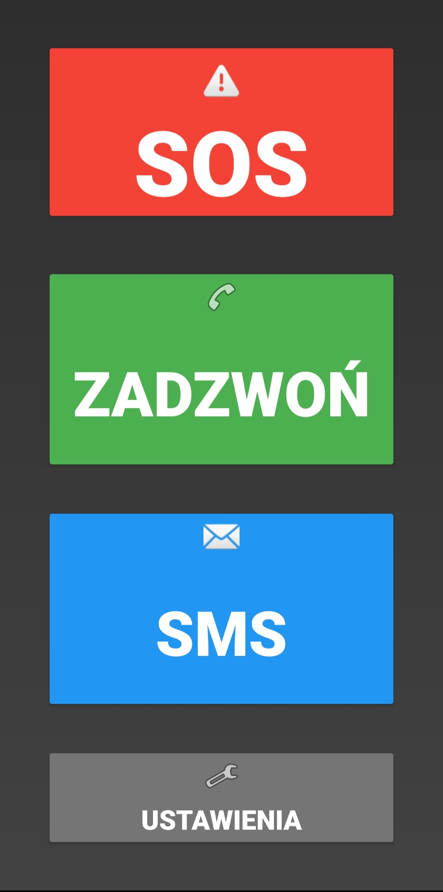
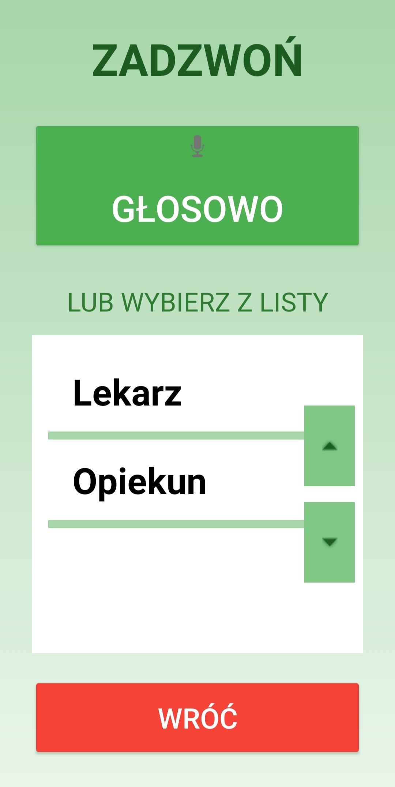
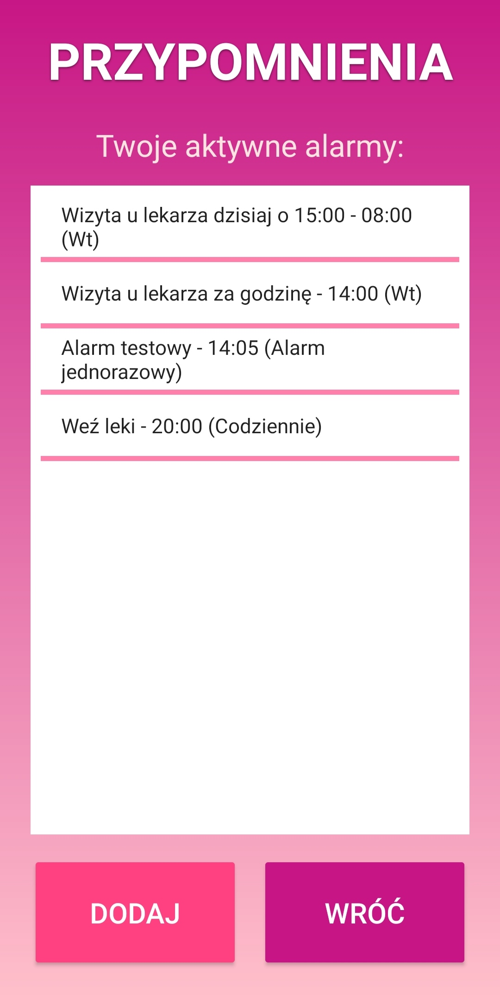

# 📱 Digital Care

[](https://kotlinlang.org)
[](https://developer.android.com)
[-blue.svg)](https://developer.android.com/about/dashboards)
[]()

**Digital Care** is a native Android application designed to make smartphone usage accessible for **elderly people and individuals with disabilities**.

Smartphones are often too complex for seniors due to small icons, low contrast, and confusing navigation. This project replaces the standard interface with a simplified, high-contrast launcher that focuses on safety and essential communication functionality.

---

## ✨ Key Features

* **🔲 High-Accessibility UI:** Large buttons, high-contrast color palette, and readable typography designed for visually impaired users.
* **🆘 SOS System:** A dedicated, easily accessible emergency button.
* **📞 Simplified Communication:** Streamlined interface for making calls and sending SMS messages without navigating complex menus.
* **🗣️ Voice Control:** Integrated voice commands for hands-free operation.
* **⏰ Smart Alarms:** Easy-to-set reminders for medication or daily tasks.
* **📱 Legacy Support:** Optimized to run smoothly on older devices (Android 7.0+).

---

## 📸 Screenshots

| Home Screen | Calling Interface | Reminders List |
|:---:|:---:|:---:|
|  |  |  |

---

## 🛠️ Tech Stack & Architecture

This project was built using native Android development practices to ensure stability and broad device compatibility.

* **Language:** Kotlin
* **UI/Layout:** XML (ConstraintLayout, LinearLayout)
* **Data Persistence:** SharedPreferences (for storing user settings and alarms locally)
* **Data Parsing:** Gson (JSON handling)
* **Compatibility:** AndroidX & AppCompat (ensuring support for API Level 24+)
* **Hardware Integration:** TelephonyManager (Calls), SmsManager (Messaging)

---

## 🚀 Getting Started

To run this project locally:

1.  **Clone the repository:**
    ```bash
    git clone [https://github.com/hubertdurnass/DigitalCare.git](https://github.com/hubertdurnass/DigitalCare.git)
    ```
2.  **Open in Android Studio:**
    File -> Open -> Select the cloned folder.
3.  **Build & Run:**
    Connect an Android device (USB Debugging enabled) or use an Emulator (API 24+).

---

## 👨‍💻 Author

**Hubert** - *Electronics & Telecommunications Engineer (AGH UST)*

